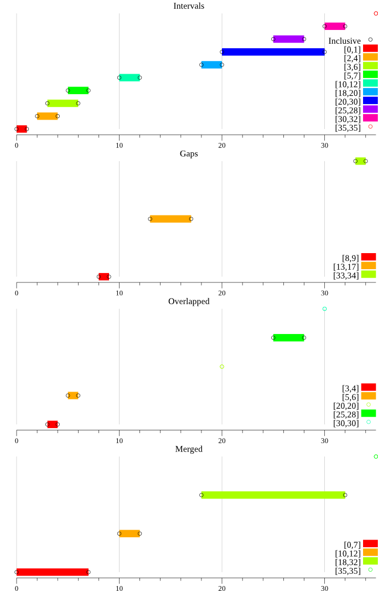

# intervals [](https://opensource.org/licenses/MIT) [](https://godoc.org/github.com/centraldereservas/intervals)

Provides a helper to work with integer intervals detecting gaps, merged and overlapped sections.

## Installation

```sh
go get github.com/centraldereservas/intervals
```

## Motivation

Why we need to have control over a list of intervals?

Because provider API's have product prices depending on the age, so they assign a price amount to different age bands.

As a result we have a bunch of age bands (with its corresponding price) which can have:

- overlapping ages (due to an error entering the data).
- gaps in between age bands.
- different maximal age (for adult) depending on the provider (e.g. one can specify [18,99] and another [18-999] meaning the same).
- some providers do not create an age band for babies which has to be interpret as free entry, so we have a gap at the beginning.

So we need a mechanism to enter a list of age bands and be able to analyse it to take future actions.

## Documentation

We define an interval as

```go
type Interval struct {
   Low    int
   High   int
   Object interface{}
}
```

where the `Low` and `High` values define a range and `Object` is any object to link to this range (in our case would be a Price object for the age band specified in the range).

API documentation is available on [godoc.org][doc].

## Usage

### Initialization

To use this package the first thing we have to do is create an instance:

```go
intvls := interval.NewIntervals(minLow, maxHigh, lowInclusive, highInclusive, selfAdjustMinLow, selfAdjustMaxHigh)
```

where `minLow` and `maxHigh` are integers that defines the accepted integer space to work with, anything else outside will be rejected. The booleans `lowInclusive` and `highInclusive` indicates if the values of a range (low, high) are inclusive or not. The booleans `selfAdjustMinLow`and `selfAdjustMaxHigh` indicates that we do not need to specify the minLow or maxHigh in the constructor, but those values will be self adjusted automatically taking the lower and greatest value  respectively of all intervals added.

Here some examples of inclusiveness:

- if both are inclusive for the interval [10, 17] means that a person with age 17 years old applies this interval
- if the low is inclusive and the high exclusive for the same example [10, 17) then a person with age 17 do not apply this interval, but a person with 10 does.

### Add intervals

Once initialized, we can proced to add new intervals.

We can add intervals by passing an `Interval` object:

```go
intvl := &interval.Interval{Low: ageFrom, High: ageTo, Object: myObject}
err := intvls.AddInterval(intvl)
if err != nil {
   fmt.Printf("invalid interval discarded: %v\n", err)
}
```

or directly the values `Low`, `High` and `Object`:

```go
err := intvls.Add(low: ageFrom, high: ageTo, obj: myObject)
if err != nil {
   fmt.Printf("invalid interval discarded: %v\n", err)
}
```

### Get all intervals

Returns all the intervals added sorted by the `Low` integer value.

```go
allIntervals := intvls.GetIntervals()
```

NOTE: any operation (get all, gaps, merge, overlap) apply a sort if needed.

### Find value inside intervals

Given an integer value we can retrieve all intervals which cointain it

```go
list := intvls.FindIntervalsForValue(tc.valueToFind)
```

### Calculate gaps

Before getting the gaps, we could verify if exists any:

```go
existsGaps := intvls.HasGaps() 
```

Once we assure the gaps existance we can call `Gaps()`. This function scans all intervals searching for gaps in between and return a list of intervals corresponding to the gaps.

```go
gaps := intvls.Gaps()
```

### Calculate overlapping

Before getting the overlapped elements, we could verify if exists any:

```go
existsOverlapping := intvls.HasOverlapped() 
```

Once we assure the existance overlapping we can call `Overlapped()`. This function scans all intervals searching for overlapping in between and return a list of intervals corresponding to the overlaped sections.

```go
overlapping := intvls.Overlapped()
```

### Calculate merging

If we join together all the intervals we can fusion all them and as a result we will get a list of intervals merged, this is what the function `Merge` does:

```go
merging := intvls.Merge() 
```


## Example

There is a complete example under the `/example/` folder in the source code that shows how the package is used.

Output:

```sh
go run ./example/main.go
```

This example generates an output image file exposing the data analyzed:




## References

* [justforfunc #34: Plotting Data with gonum/plot](https://youtu.be/ihP7lQivA6M) by [Francesc Campoy](https://github.com/campoy)


## License

This project is under the [MIT License][mit].

[mit]: https://github.com/centraldereservas/intervals/blob/master/LICENSE
[doc]: https://godoc.org/github.com/centraldereservas/intervals